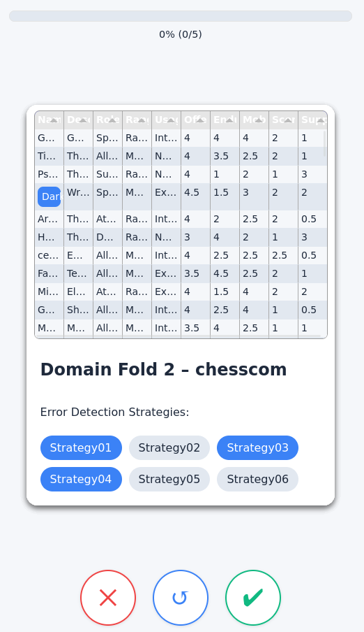
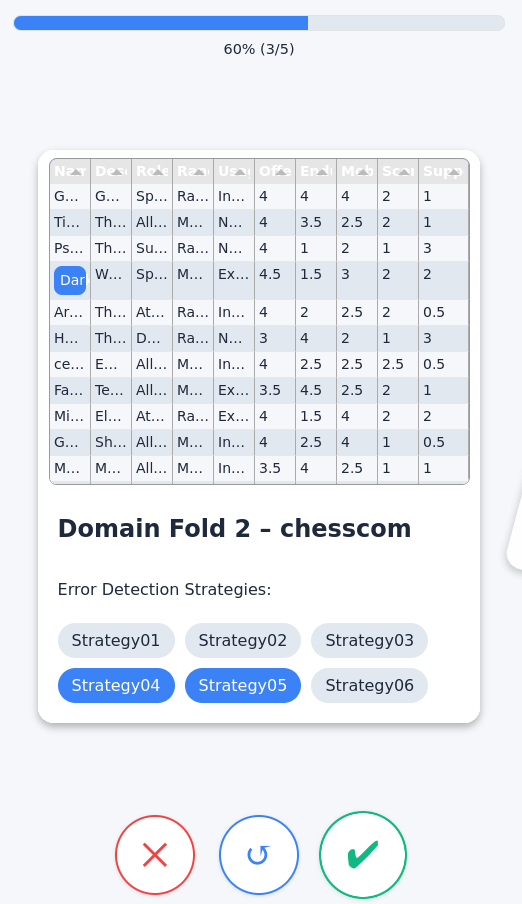
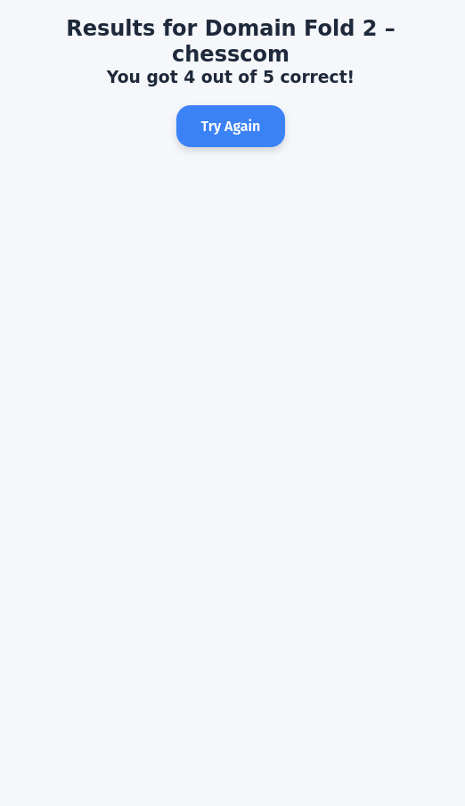

# MaTElDa BIFOLD-Day Presentation


## 📸 Demo






## 📦 Installation

```bash
# Clone the repo
git clone https://github.com/lejuliennn/data-tinder-presentation.git

# Navigate into the directory
cd data-tinder-presentation
```

```python
# Start webserver
python -m http.server 8000

# visit local page
http://localhost:8000
```
